# Hardware

## Burnwire mechanism

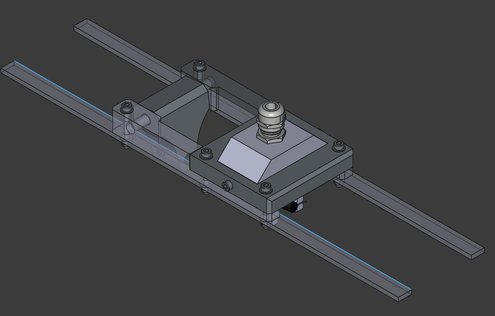
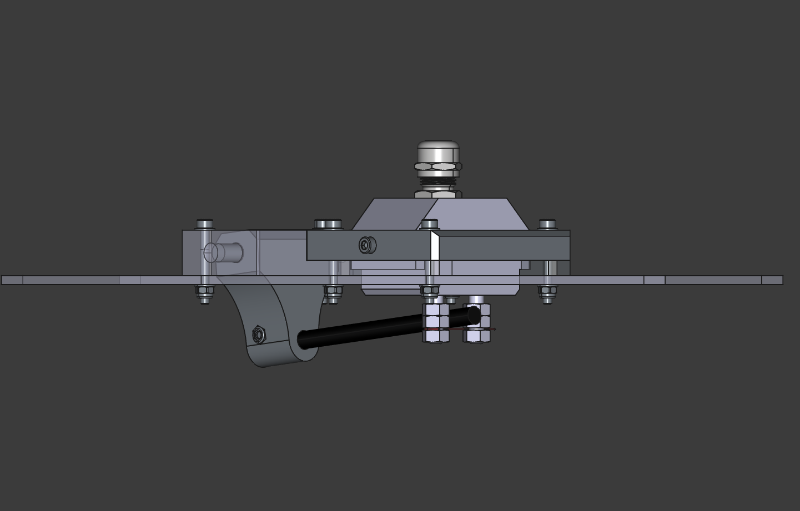
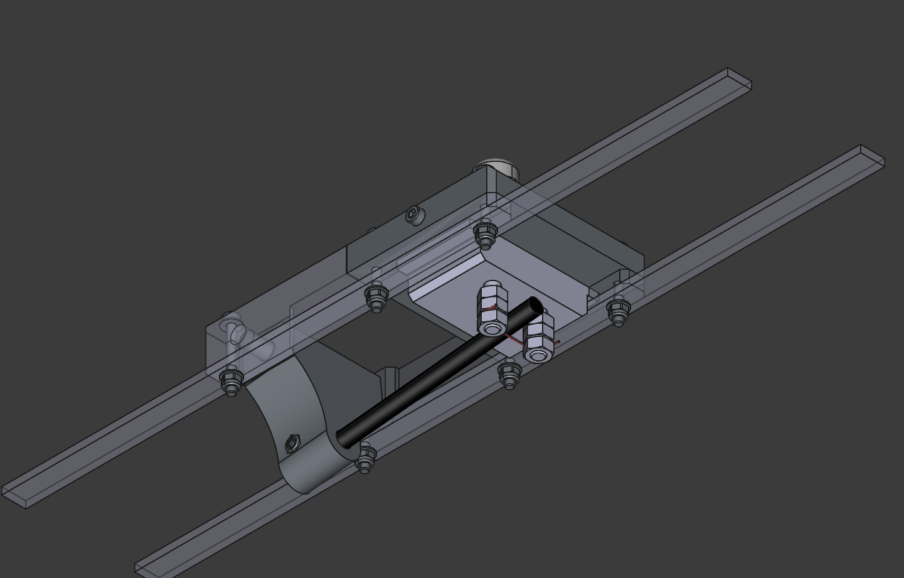
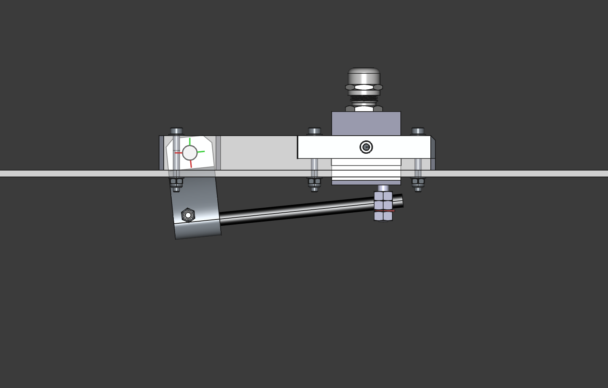
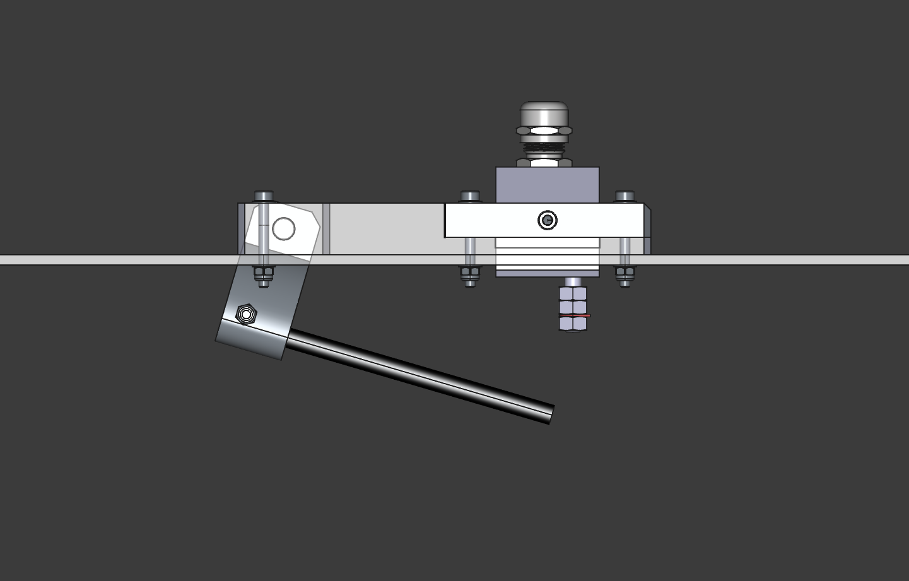

### Hardware BOM

**All rods and fasteners must be stainless steel 316/A4**

* Rod 6x55mm
* Rod 6x100mm
* M12 Cable gland
* 2x Ring terminals
* 2x M5x25 ISO4017, [DIN 933 ](https://accu-components.com/us/full-thread-hexagon-bolts/19162-SEBF-M5-25-A4)  Screw (Hexagon head)
* 8x M5 nut [DIN 934](https://accu-components.com/us/hexagon-nuts/7910-HPN-M5-A4)
* 2x M5 [Star Washer](https://accu-components.com/us/external-fine-tooth-locking-washers/63131-HLFW-M5-A4)
* 7x M3 [DIN 985](https://accu-components.com/us/hexagon-nylon-locking-nuts/7957-HNN-M3-A4) (Nylon lock nut)
* 2x M3 nut [DIN 934](https://accu-components.com/us/hexagon-nuts/7907-HPN-M3-A4)
* 12x M3 Washer [DIN 125](https://accu-components.com/us/metric-flat-washers/72508-HPW-M3-A4)
  * Optional replace 6x M3 spring washers [DIN127B](https://accu-components.com/us/rectangular-profile-spring-washers/62558-HRSW-M3-A4)
* 2x M3x10 [DIN 912](https://accu-components.com/us/metric-cap-head-screws/3975-SSCF-M3-10-A4), DIN7984 or ISO4762 (Socket Head)
* M3x12 [DIN 912](https://accu-components.com/us/metric-cap-head-screws/3976-SSCF-M3-12-A4), DIN7984 or ISO4762 (Socket Head)
* 6x M3x25 [DIN 912](https://accu-components.com/us/metric-cap-head-screws/642040-SSCF-M3-25-A4), DIN7984 or ISO4762 (Socket Head)

* Nichromium wire

### 3D printing 

**Parts**
* BurnwireHolder
* BurnwireHolderSlot
* Gimbal
* GimbalHolder
* GimbalHolder (Mirror)

**3D printing orientation**
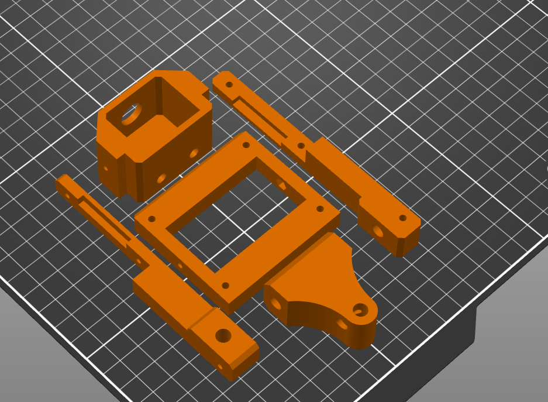

**Printing Instructions**
* 100% infill
* Materials - Before choosing material, ensure your printed can print it. 
  * [PC blend](https://www.prusa3d.com/product/prusament-pc-blend-natural-970g/#printing-setup)
  * [ASA](https://www.prusa3d.com/product/prusament-asa-natural-850g/)
  * PETG

### Assembly

**All printed parts should be coated in waterproofing material**
Good choices would be [dichtol AM Hydro](https://diamant-polymer.de/en/shop/dichtol/am-hydro/), epoxy, other specialized coats for 3D printing.

**Prepare mounting holes on the steel beams** Use drill template provided to punch mark drill holes. Shorter side is where Nichromium wire will be placed. 
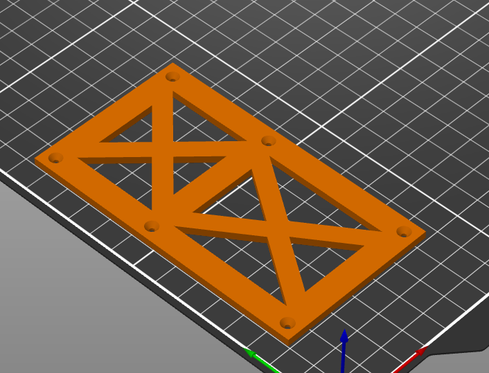 

1. Make key cutout on 100mm rod. 5mm from the end, 4mm wide.

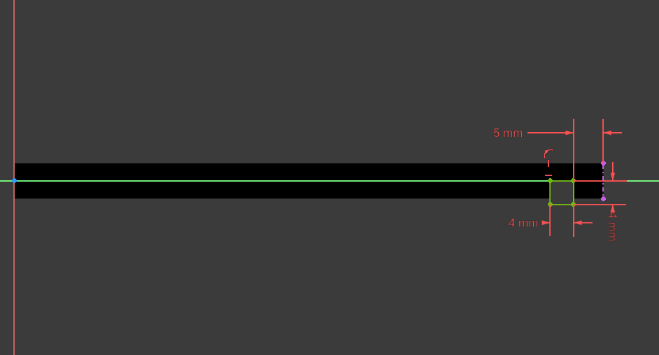
2. Assemble Gimbal
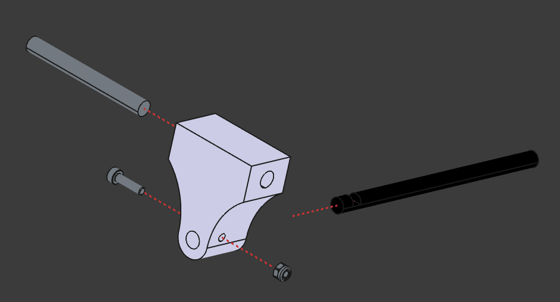
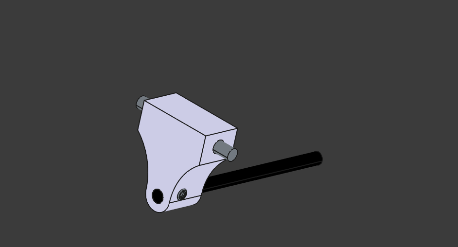
    1. Insert 100mm rod with a cutout facing up, towards the screw hole.
    2. Fix it with M3x12 and nylon nut
    3. Insert 55m rod
3. Mount GimbalHolders and BurnWireHolderSlot
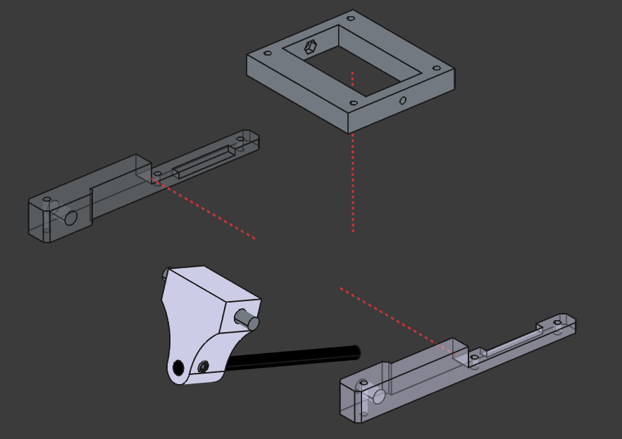
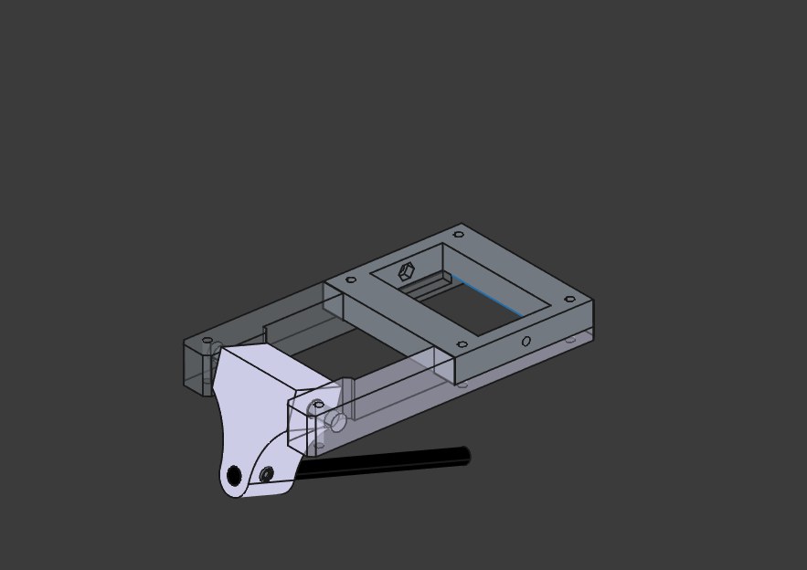
4. Fix it to the steel beams using M3x25 screws, washers and nylon locknuts. Ensure that washers have contact with 3D printed part. For metal surface it could be used a spring or starwasher to lock it in place.
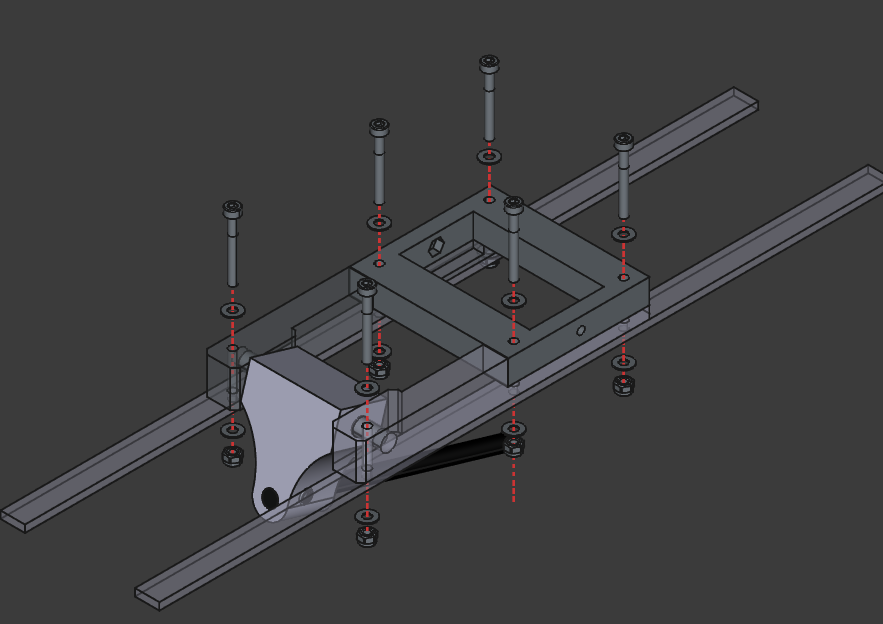
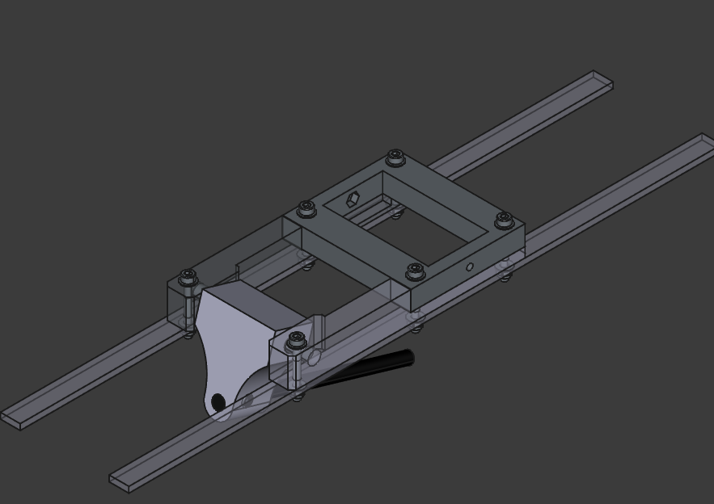
5. Insert 2x M3 nuts to the BurnWireHolderSlot
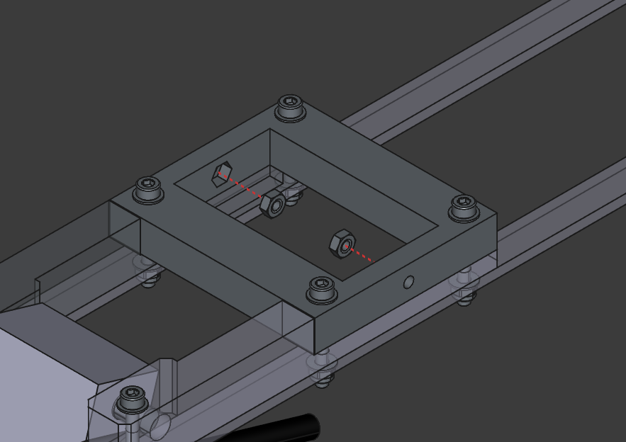

6. **Crimp the cable to the ring terminal** !!!
7. Prepare 2x ring terminal stacks. Make it **tight**. In oder:
    1. Screw
    2. Ring terminal
    3. Star washer (not regular washer), for better contact/conductivity.
    4. Nut
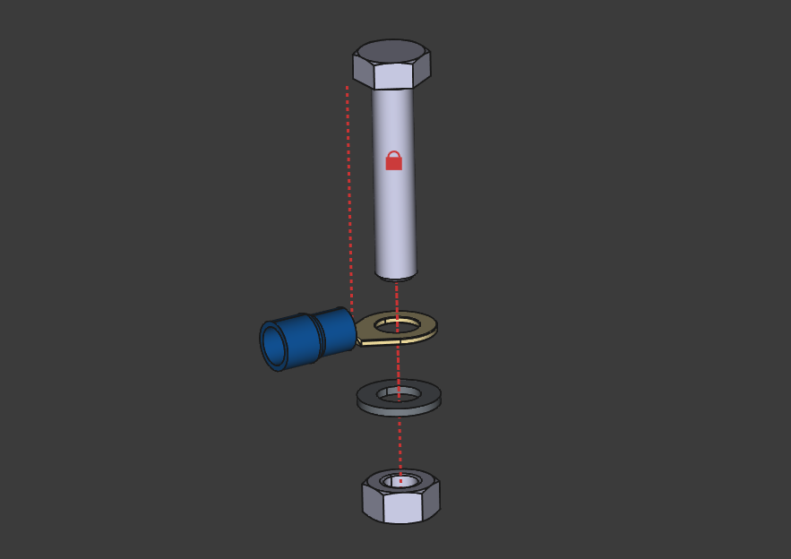
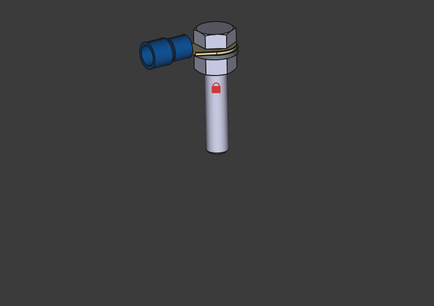
8. BurnwireHolder Assembly
    1. Insert ring terminal stack into the BurnwireHolder
    2. Lock it with nuts.
    3. Insert Cable gland
    4. Pass cable via cable gland. 
    5. Fill/seal it with epoxy resing. It could be mixed with glass fiber shreddings for extra strength.
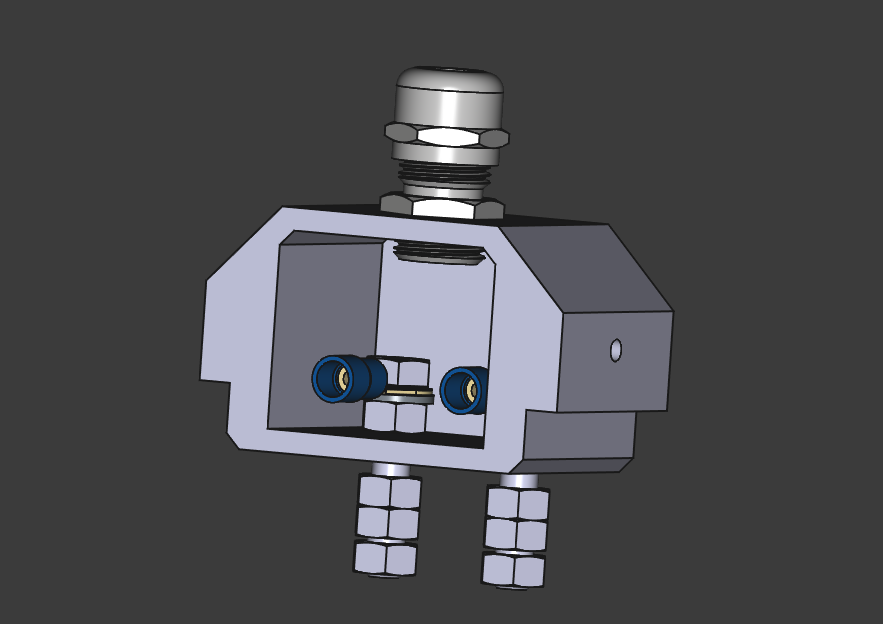
2 out of 3 nuts at the outside of the casing should be locked in together. They can be either touching the casing or not. The last most bottom nut should be used for locking in the burn wire.
9. Insert BurnwireHolder assembly into the slot
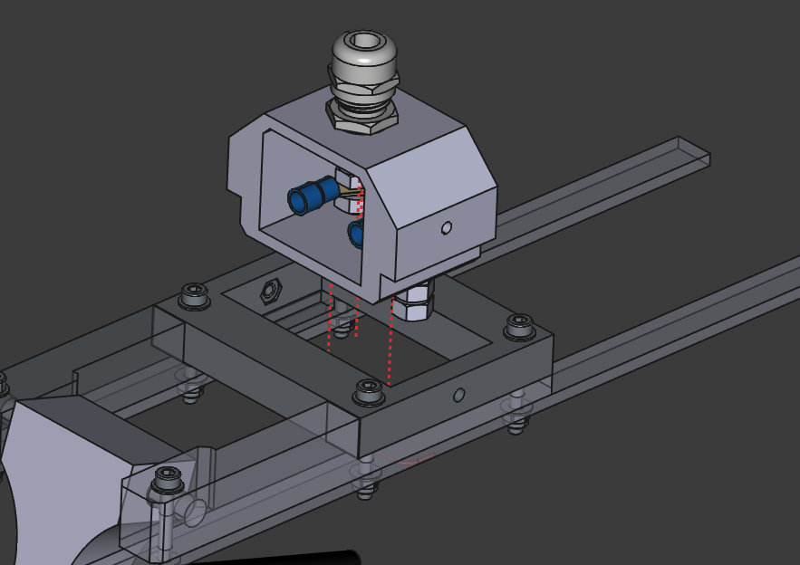

10. Fix the burnwireholder with 2x M3x10 screws
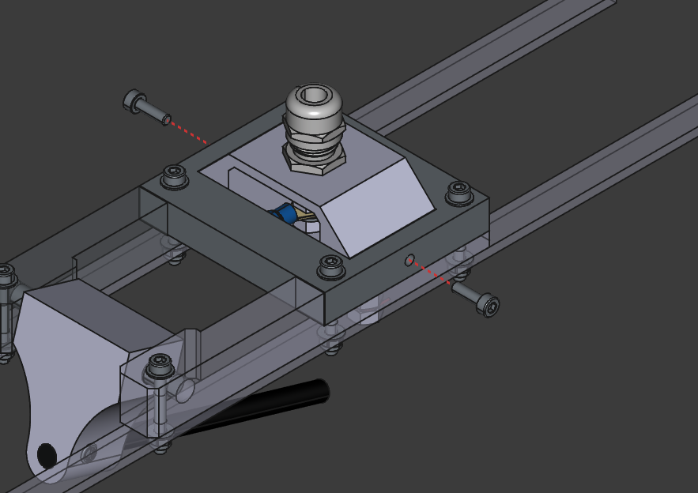
11. Load the burn wire
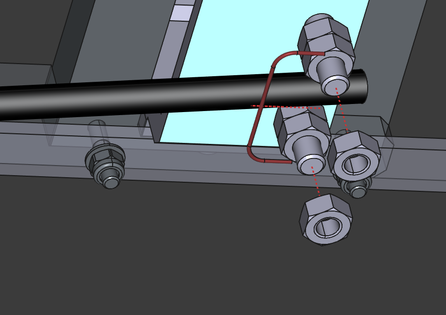
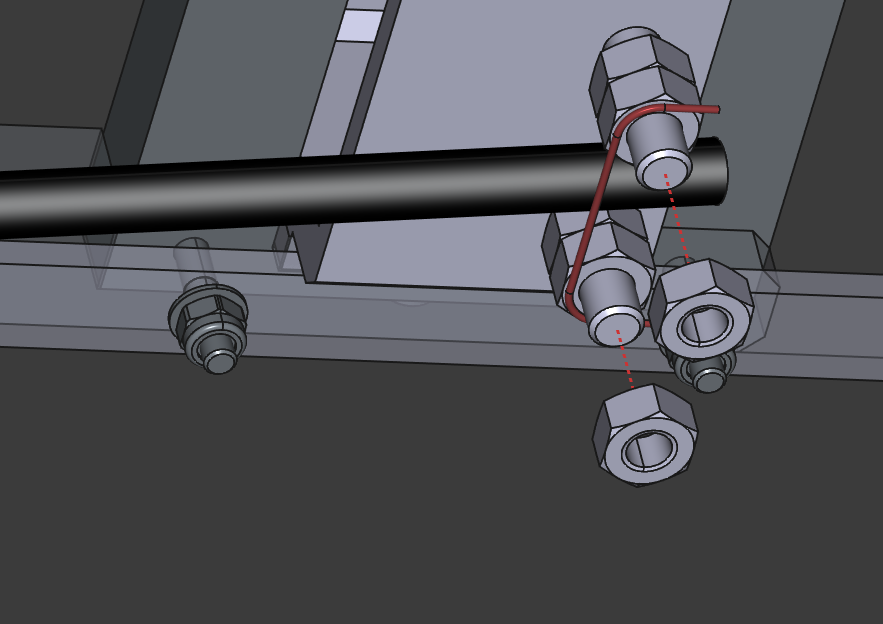
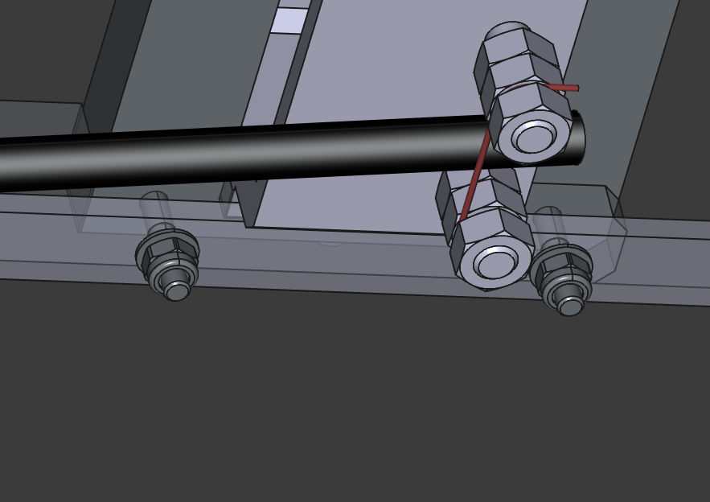
